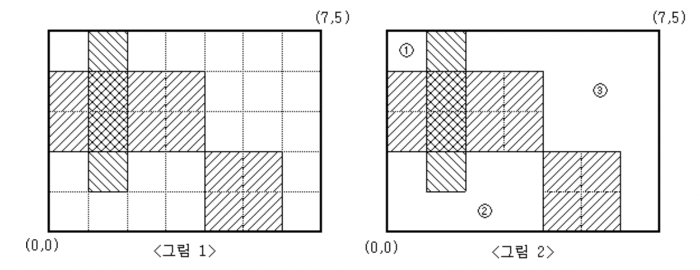

# 문제 정보
- 문제 링크 : [2583 - 영역 구하기](https://www.acmicpc.net/problem/2583)
- 알고리즘 유형 : DFS/BFS
- 제출 언어 : Python3

# 문제
눈금의 간격이 1인 M×N(M,N≤100)크기의 모눈종이가 있다. 이 모눈종이 위에 눈금에 맞추어 K개의 직사각형을 그릴 때, 이들 K개의 직사각형의 내부를 제외한 나머지 부분이 몇 개의 분리된 영역으로 나누어진다.

예를 들어 M=5, N=7 인 모눈종이 위에 <그림 1>과 같이 직사각형 3개를 그렸다면, 그 나머지 영역은 <그림 2>와 같이 3개의 분리된 영역으로 나누어지게 된다.



<그림 2>와 같이 분리된 세 영역의 넓이는 각각 1, 7, 13이 된다.

M, N과 K 그리고 K개의 직사각형의 좌표가 주어질 때, K개의 직사각형 내부를 제외한 나머지 부분이 몇 개의 분리된 영역으로 나누어지는지, 그리고 분리된 각 영역의 넓이가 얼마인지를 구하여 이를 출력하는 프로그램을 작성하시오.

### 입력
- 첫째 줄에 M과 N, 그리고 K가 빈칸을 사이에 두고 차례로 주어진다. M, N, K는 모두 100 이하의 자연수이다.
- 둘째 줄부터 K개의 줄에는 한 줄에 하나씩 직사각형의 왼쪽 아래 꼭짓점의 x, y좌표값과 오른쪽 위 꼭짓점의 x, y좌표값이 빈칸을 사이에 두고 차례로 주어진다. 모눈종이의 왼쪽 아래 꼭짓점의 좌표는 (0,0)이고, 오른쪽 위 꼭짓점의 좌표는(N,M)이다. 입력되는 K개의 직사각형들이 모눈종이 전체를 채우는 경우는 없다.

### 출력
- 첫째 줄에 분리되어 나누어지는 영역의 개수를 출력한다. 둘째 줄에는 각 영역의 넓이를 오름차순으로 정렬하여 빈칸을 사이에 두고 출력한다.

# 코드
```python
import sys
sys.setrecursionlimit(10 ** 7)

m,n,k = map(int, sys.stdin.readline().split())
graph = [[0] * (n+1) for _ in range(m+1)]
dx = [0, 0, -1, 1]
dy = [-1, 1, 0, 0]

for _ in range(k):
    x1, y1, x2, y2 = map(int, sys.stdin.readline().split())
    for i in range(y1, y2):
        for j in range(x1, x2):
            graph[i][j] = 1

def dfs(y, x, size):
    graph[y][x] = 1
    for dX, dY in zip(dx, dy):
        new_x = x + dX
        new_y = y + dY
        if 0 <= new_x <n and 0 <= new_y < m and graph[new_y][new_x] == 0:
            size = dfs(new_y, new_x, size+1)
    return size

size_list = []
for i in range(m):
    for j in range(n):
        if graph[i][j] == 0:
            size_list.append(dfs(i, j, 1))

print(len(size_list))
print(*sorted(size_list))
```

# 설명
m,n의 그래프를 먼저 만들어줬다. 0으로 초기화 해 놓고, k개의 사각형에 대한 좌표 값을 받아 해당 사각형 범위는 값을 1로 바꿔줬다.
그리고 그래프를 돌면서 값이 0이면 해당 사각형의 크기를 구하게 했다. 크기가 구해지면 해당 값을 `size_list` 라는 배열에 넣고, 마지막에 오름차순으로 정렬해서 출력했다.

